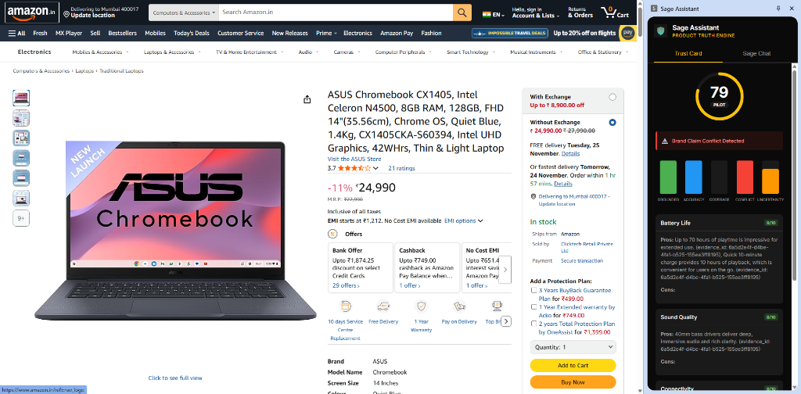
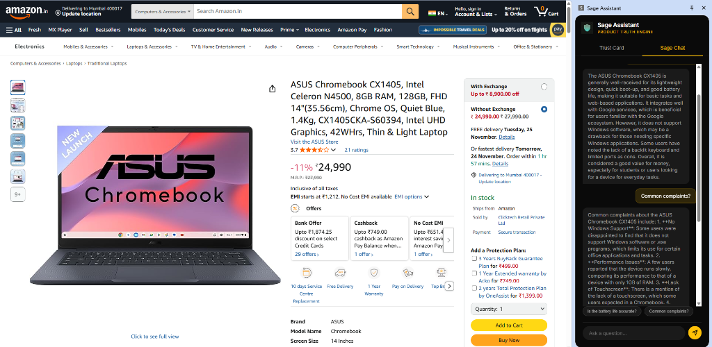

# Sage Bot - AI-Powered Product Truth Engine

Sage Bot is an intelligent product analysis system that uses multi-agent AI to evaluate product claims, detect conflicts, and provide trustworthy insights. It combines web scraping, vector search, and LLM-powered analysis to generate a Trust Confidence Score (TCS) for any product.

## 🖼️ Screenshots

### Trust Card View
The Trust Card provides an at-a-glance view of the product's trustworthiness with:
- **TCS Score**: Overall trust confidence score (0-100)
- **Conflict Detection**: Alerts when brand claims conflict with evidence
- **Trust Pillars**: Visual breakdown of Groundedness, Accuracy, Coverage, Conflict, and Uncertainty
- **Aspect Analysis**: Detailed scores for product-specific aspects (Battery Life, Sound Quality, etc.)



### Sage Chat View
Interactive chat interface to ask questions about the product:
- **Contextual Answers**: Get detailed responses based on analyzed evidence
- **Source Citations**: All answers are grounded in retrieved evidence
- **Natural Conversation**: Ask follow-up questions naturally



## ✨ Features

- **Multi-Agent AI System**: Planner, Retriever, VLM, Summarizer, and Judge agents work together
- **Trust Confidence Score (TCS)**: Quantitative measure of product trustworthiness (0-100)
- **Conflict Detection**: Identifies contradictions between brand claims and evidence
- **Chrome Extension**: Analyze products directly while browsing
- **Web Application**: Standalone web interface for product analysis
- **Evidence-Based**: All claims backed by retrieved evidence with citations

## 🏗️ Architecture

### Components

- **Backend** (`main.py`, `sage/`): FastAPI server with AI agents
- **Frontend** (`frontend/`): Next.js web application
- **Chrome Extension** (`chrome_extension/`): Browser extension for on-page analysis
- **Vector Database**: ChromaDB for semantic search
- **LLM Integration**: Support for OpenAI, Anthropic, and Google Gemini

### AI Agents

1. **Planner Agent**: Creates analysis strategy based on product context
2. **Retriever Agent**: Searches vector DB for relevant evidence
3. **VLM Agent**: Processes product images for specs and details
4. **Summarizer Agent**: Synthesizes evidence into structured summaries
5. **Judge Agent**: Validates claims against evidence

## 🚀 Quick Start

### Prerequisites

- Python 3.8+
- Node.js 16+ (for frontend)
- API keys for LLM providers (OpenAI/Anthropic/Gemini)

### Backend Setup

1. **Install Dependencies**:
   ```bash
   pip install -r requirements.txt
   ```

2. **Environment Variables**:
   Create a `.env` file with your API keys:
   ```
   OPENAI_API_KEY=your_key_here
   GEMINI_API_KEY=your_key_here
   ANTHROPIC_API_KEY=your_key_here
   ```

3. **Run the Server**:
   ```bash
   python -m uvicorn main:app --reload --host 0.0.0.0 --port 8001
   ```

   The API will be available at `http://localhost:8001`

### Chrome Extension Setup

1. Open Chrome and go to `chrome://extensions/`
2. Enable "Developer mode"
3. Click "Load unpacked"
4. Select the `chrome_extension` directory
5. The Sage Assistant icon will appear in your extensions

### Frontend Setup (Optional)

1. Navigate to the frontend directory:
   ```bash
   cd frontend
   npm install
   npm run dev
   ```

2. Open `http://localhost:3000`

## 📖 API Documentation

Visit `http://localhost:8001/docs` for interactive Swagger UI.

### Key Endpoints

- **`POST /ingest/web`**: Ingest a product URL
- **`POST /ingest/extension`**: Ingest data from Chrome Extension
- **`POST /process`**: Run full analysis pipeline
- **`POST /chat`**: Chat with Sage about the product

## 🧪 Testing

Run the test suite:

```bash
python verify_all.py
```

Individual test files:
- `test_pipeline.py`: Test the full analysis pipeline
- `test_tcs.py`: Test TCS calculation
- `test_agents.py`: Test individual agents

## 📁 Project Structure

```
Sage_Bot/
├── sage/
│   ├── agents/          # AI agents (Planner, Retriever, VLM, Summarizer, Judge)
│   ├── engine/          # TCS Engine
│   ├── models/          # Pydantic schemas
│   └── utils/           # LLM client, Vector DB, utilities
├── chrome_extension/    # Chrome extension files
├── frontend/            # Next.js web application
├── config/              # Configuration files
├── screenshots/         # UI screenshots
├── main.py              # FastAPI application
└── requirements.txt     # Python dependencies
```

## 🔧 Configuration

Edit `config/models_config.json` to configure LLM models for each agent:

```json
{
  "planner": {
    "provider": "openai",
    "model": "gpt-4o-mini",
    "temperature": 0.3
  },
  "summarizer_trust": {
    "provider": "gemini",
    "model": "gemini-2.0-flash-exp",
    "temperature": 0.0
  }
}
```

## 🤝 Contributing

Contributions are welcome! Please feel free to submit a Pull Request.

## 📄 License

This project is licensed under the MIT License.

## 🙏 Acknowledgments

Built with:
- FastAPI
- ChromaDB
- OpenAI/Anthropic/Google Gemini APIs
- Next.js
- Chrome Extensions API
